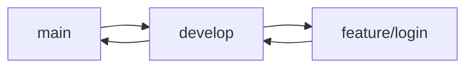

# 📁 Git 브랜치 전략 가이드

## 📌 브랜치 구조
```
main        ← 배포용 (항상 안정된 상태 유지)
develop     ← 통합 개발용 (기능 완료 후 머지되는 곳)
feature/*   ← 기능 단위 작업용 브랜치
bugfix/*    ← 버그 수정 브랜치
hotfix/*    ← 긴급 버그 수정 브랜치 (서비스 영향 큰 경우)
```

---

## 🧭 브랜치 생성 및 병합 흐름



---

## ✅ 브랜치 생성 규칙

1. **기능 개발 전 `develop` 브랜치 최신 상태로 동기화**
   ```bash
   git checkout develop
   git pull origin develop
   ```

2. **기능 단위 브랜치 생성 (형식: `feature/기능명`)**
   ```bash
   git checkout -b feature/login
   ```

3. **작업 완료 후 `develop`으로 Pull Request 생성**
   - PR 제목: `[feat] 로그인 기능 추가`
   - Reviewer 지정
   - 변경사항 요약 포함

4. **팀장이 `develop → main`으로 병합 및 배포**

---

## 📎 브랜치 명명 규칙

| 브랜치 타입 | 예시 |
|-------------|------|
| 기능 개발   | `feature/login` |
| 버그 수정   | `bugfix/login-crash` |
| 리팩토링    | `refactor/api-endpoint` |
| 긴급 수정   | `hotfix/crash-on-login` |

---

## 🚫 주의사항

- `main` 브랜치에 **직접 push 금지**
- `develop` 브랜치도 **반드시 PR을 통해 병합**
- 기능 하나당 브랜치 하나 → 완료 후 브랜치 삭제 권장
  ```bash
  git branch -d feature/login         # 로컬
  git push origin --delete feature/login  # 원격
  ```

---

## 🧩 예시 흐름 (소셜 로그인 기능 개발 시)

```bash
git checkout develop
git pull origin develop
git checkout -b feature/social-login
# 작업 진행 후 commit
git push origin feature/social-login
# GitHub에서 PR 생성 → 대상 브랜치: develop
```

---

## ✍️ 커밋 메시지 작성 규칙

커밋 메시지는 작업의 목적을 명확하게 전달하기 위해 아래 형식을 따릅니다:

```
[태그] 작업 내용 요약 (한 줄로)
```

### ✅ 자주 쓰는 태그 예시

| 태그      | 의미                         | 예시 |
|-----------|------------------------------|------|
| `[feat]`  | 새로운 기능 추가             | `[feat] 소셜 로그인 구현` |
| `[fix]`   | 버그 수정                    | `[fix] 로그인 오류 수정` |
| `[refactor]` | 리팩토링 (기능 변화 없음) | `[refactor] 로그인 로직 정리` |
| `[chore]` | 설정/환경/문서 작업 등 기타  | `[chore] ESLint 설정 추가` |
| `[docs]`  | 문서 수정                    | `[docs] README 내용 보완` |
| `[test]`  | 테스트 코드 관련             | `[test] 로그인 유닛 테스트 추가` |

### 📝 커밋 예시

```bash
git commit -m "[feat] 구글 소셜 로그인 연동"
git commit -m "[fix] 로그인 시 리디렉션 오류 수정"
```

> **Tip:** 커밋은 의미 있는 단위로 자주 나누는 것이 좋습니다.
